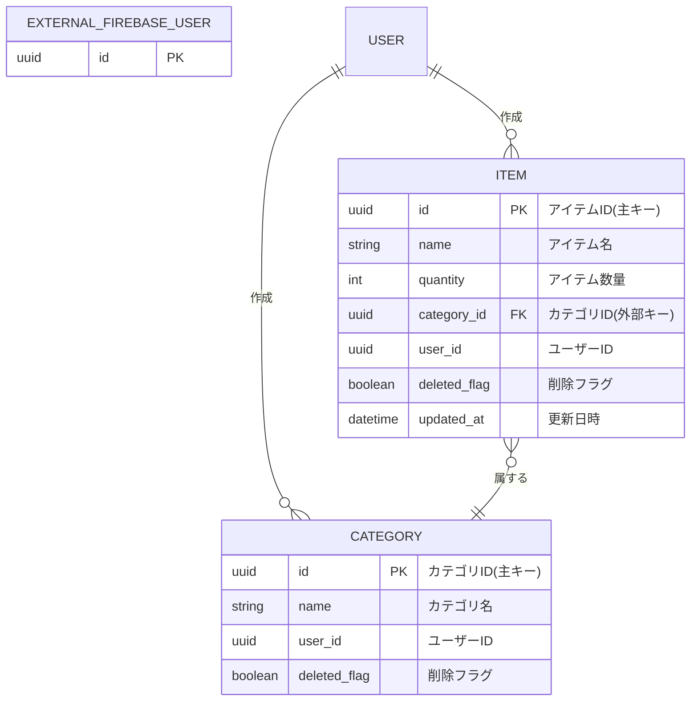

## ER図



## DBML
```
Table EXTERNAL_FIREBASE_USER {
  id uuid [pk]
}

Table category {
  id uuid [pk]
  name string
  user_id uuid [ref: > EXTERNAL_FIREBASE_USER.id]
  deleted_flag boolean
}

Table item {
  id uuid [pk]
  name string
  quantity int
  category_id uuid [ref: > category.id]
  user_id uuid [ref: > EXTERNAL_FIREBASE_USER.id, not null]
  deleted_flag boolean
  updated_at datetime
}
```