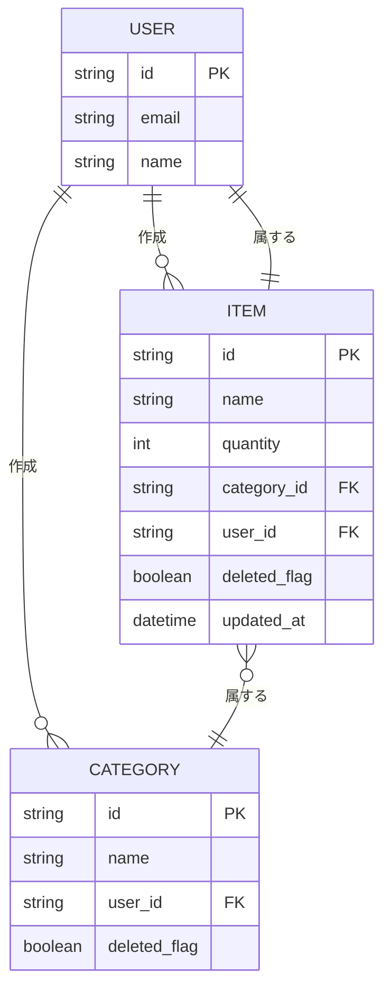

## ER図



## DBML
```
Table user {
  id string [pk]
  email string
  name string
}

Table category {
  id string [pk]
  name string
  user_id string [ref: > user.id]
  deleted_flag boolean
}

Table item {
  id string [pk]
  name string
  quantity int
  category_id string [ref: > category.id]
  user_id string [ref: > user.id, not null]
  deleted_flag boolean
  updated_at datetime
}
```