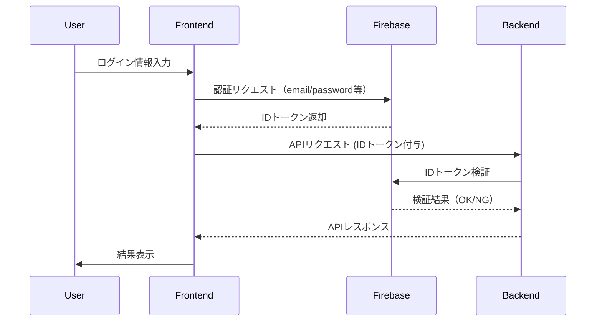

## 認証フロー

```mermaid
sequenceDiagram
    participant User
    participant Frontend
    participant Firebase
    participant Backend

    User->>Frontend: ログイン情報入力
    Frontend->>Firebase: 認証リクエスト（email/password等）
    Firebase-->>Frontend: IDトークン返却
    Frontend->>Backend: APIリクエスト (IDトークン付与)
    Backend->>Firebase: IDトークン検証
    Firebase-->>Backend: 検証結果（OK/NG）
    Backend-->>Frontend: APIレスポンス
    Frontend->>User: 結果表示
```