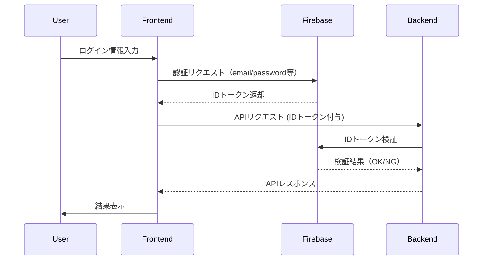
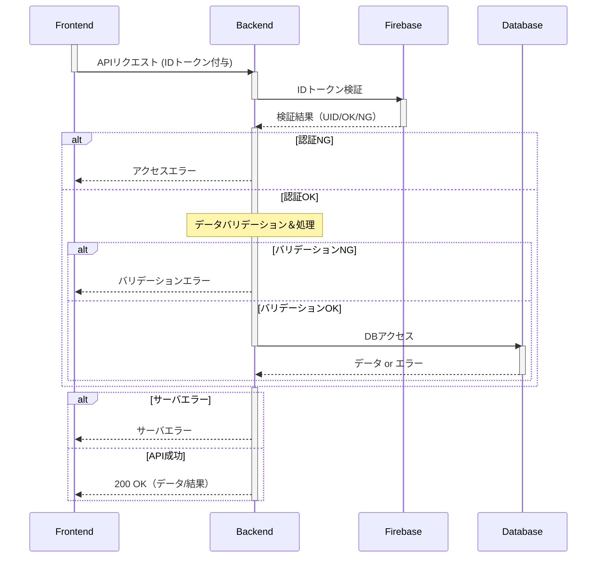

## 認証フロー

```mermaid
sequenceDiagram
    participant User
    participant Frontend
    participant Firebase
    participant Backend

    User->>Frontend: ログイン情報入力
    Frontend->>Firebase: 認証リクエスト（email/password等）
    Firebase-->>Frontend: IDトークン返却
    Frontend->>Backend: APIリクエスト (IDトークン付与)
    Backend->>Firebase: IDトークン検証
    Firebase-->>Backend: 検証結果（OK/NG）
    Backend-->>Frontend: APIレスポンス
    Frontend->>User: 結果表示
```

## エンドポイントフロー

```mermaid
sequenceDiagram
    participant Frontend
    participant Backend
    participant Firebase
    participant Database
    activate Frontend
    Frontend->>Backend: APIリクエスト (IDトークン付与)
    deactivate Frontend
    activate Backend
    Backend->>Firebase: IDトークン検証
    deactivate Backend
    activate Firebase
    Firebase-->>Backend: 検証結果（UID/OK/NG）
    deactivate Firebase
    activate Backend
    alt 認証NG
        Backend -->> Frontend: アクセスエラー
    else 認証OK
      note over Backend: データバリデーション＆処理
     
    alt バリデーションNG
        Backend -->> Frontend: バリデーションエラー
    else バリデーションOK
      Backend->>Database: DBアクセス
      deactivate Backend
      activate Database
      Database-->>Backend: データ or エラー
      deactivate Database
    end
   end 
    activate Backend
    alt サーバエラー
        Backend -->> Frontend: サーバエラー
    else API成功
        Backend-->>Frontend: 200 OK（データ/結果）
    end
    deactivate Backend
```